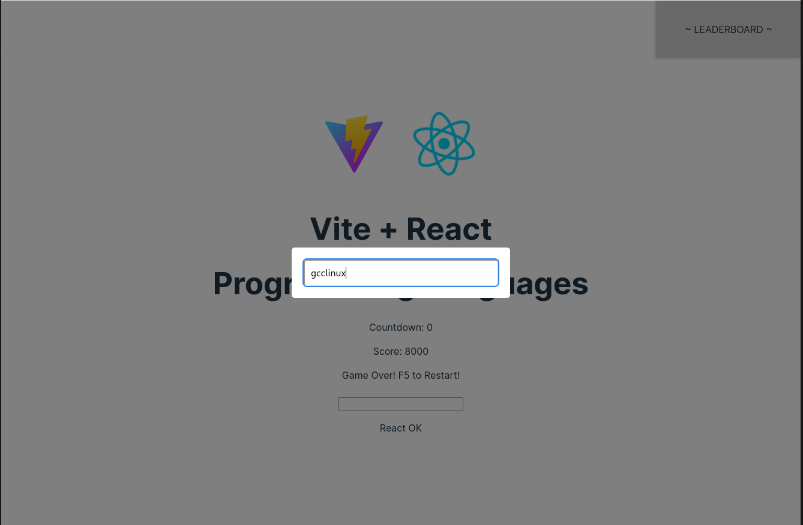
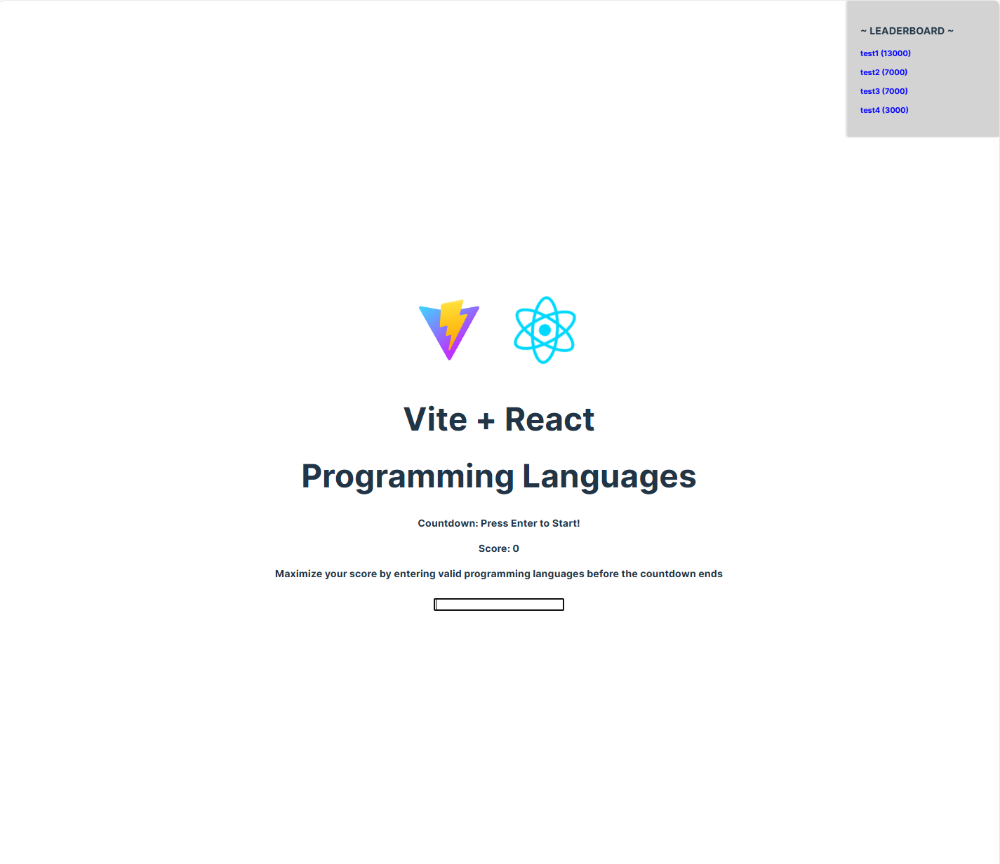

# Getting Started with Challenger React App

This project was bootstrapped with [Create React App](https://github.com/facebook/create-react-app).

## Require for cross platforms
`npm install --save-dev cross-env`

## Available Scripts

In the project directory, you can run:

```
npm create vite@latest

√ Project name: ... vite-project
√ Select a framework: » React
√ Select a variant: » JavaScript + SWC

mv vite-project challenger
mkdir -p challenger/frontend

cd challenger/frontend
## Install Vite requirements
npm install

## Install specific server side requirements
npm install express body-parser fs
```

## To run the project

```
Terminal 1
cd challenger/frontend
npm run dev

Terminal 2
cd challenger/frontend
node server.js
```

## Update server port

To change the port for a React application that uses Vite, you can set the port option in the vite.config.js file. If you don't have a vite.config.js file in your project root, you can create one.

## Example:
```
import { defineConfig } from 'vite'
import react from '@vitejs/plugin-react-swc'

// https://vitejs.dev/config/
export default defineConfig({
  plugins: [react()],
  server: {
    port: 3001,
    proxy: {
      '/api': 'http://localhost:3002',
      '/scores': 'http://localhost:3002',
    }
  },
})
```

Another way is using npm run dev, you can modify the script in your package.json file to include the --port option. Here's how you can do it:

## Example (added line "test": "vite --port 3024",):

```
  "scripts": {
    "dev": "vite",
    "test": "vite --port 3024",
    "build": "vite build",
    "lint": "eslint . --ext js,jsx --report-unused-disable-directives --max-warnings 0",
    "preview": "vite preview"
  },
  ```
  With the above example you can run your project like this:

```
Terminal 1
cd challenger/frontend
npm run dev

Terminal 2
cd challenger/frontend
node server.js
```

Example Screenshot 1


Example Screenshot 2


Example Screenshot 3
